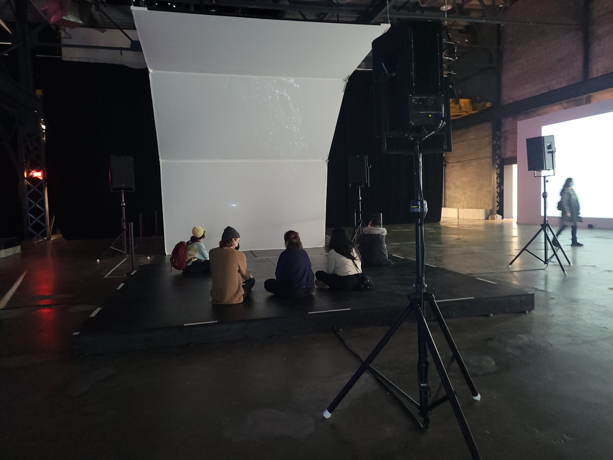
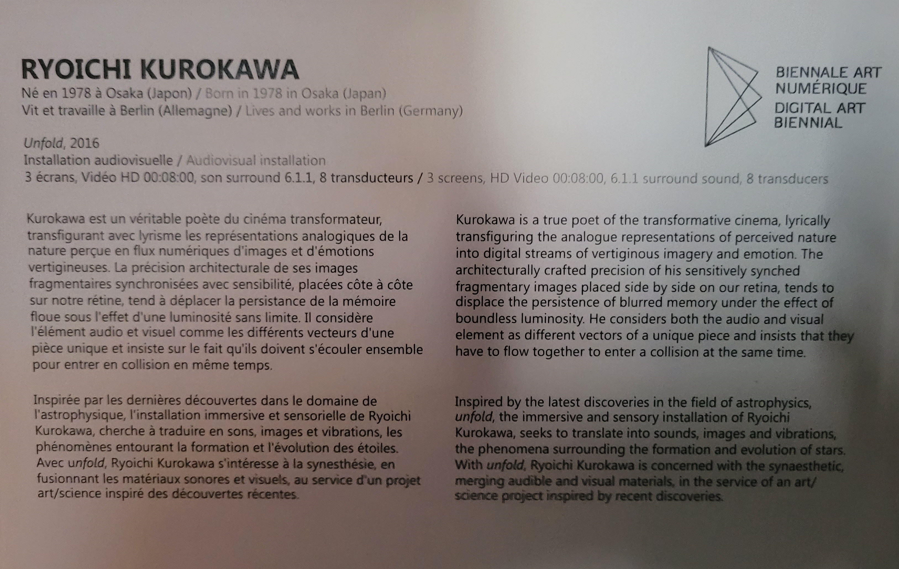
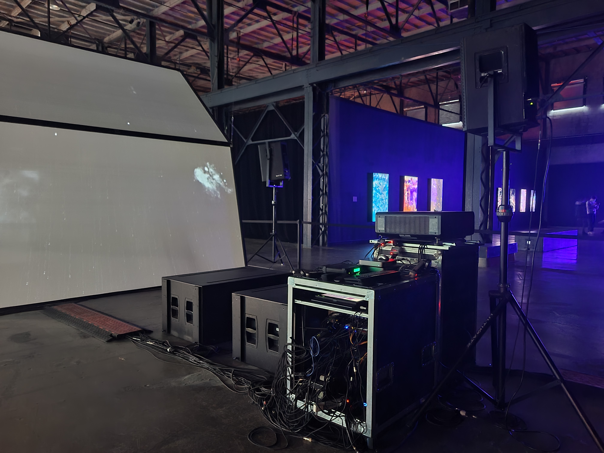
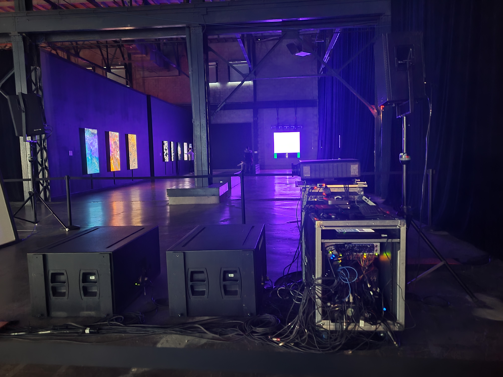
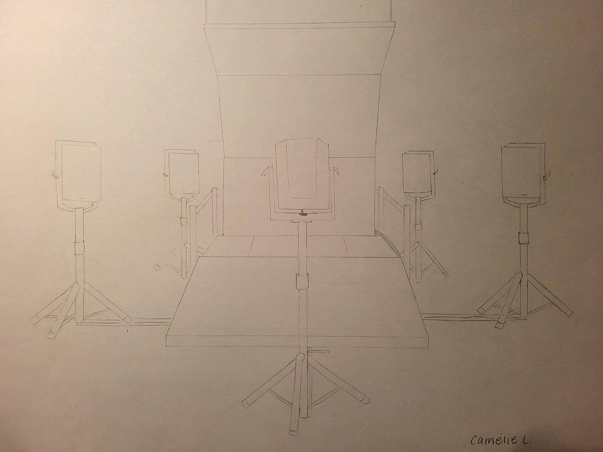
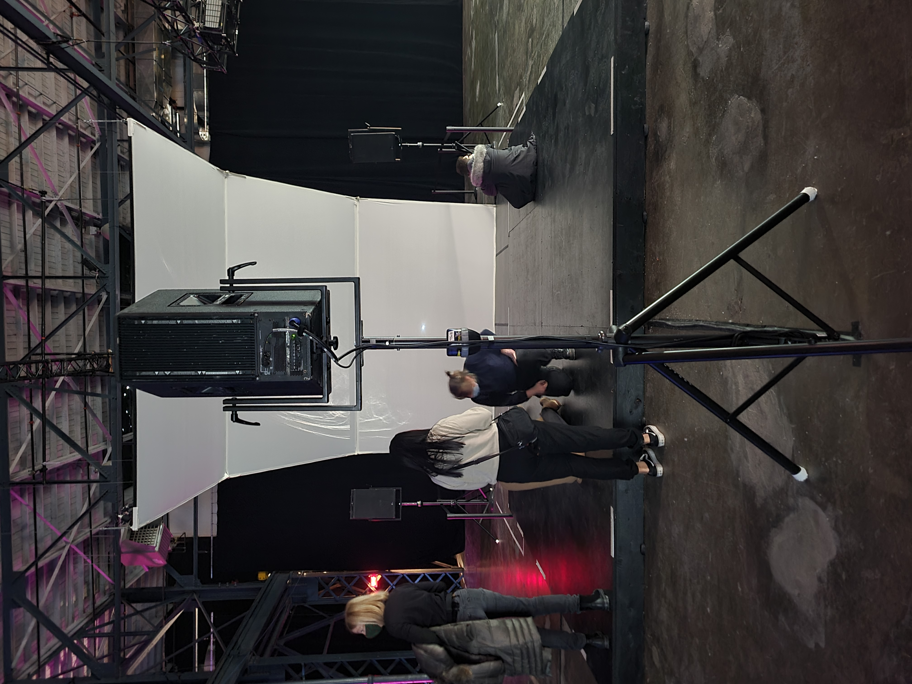
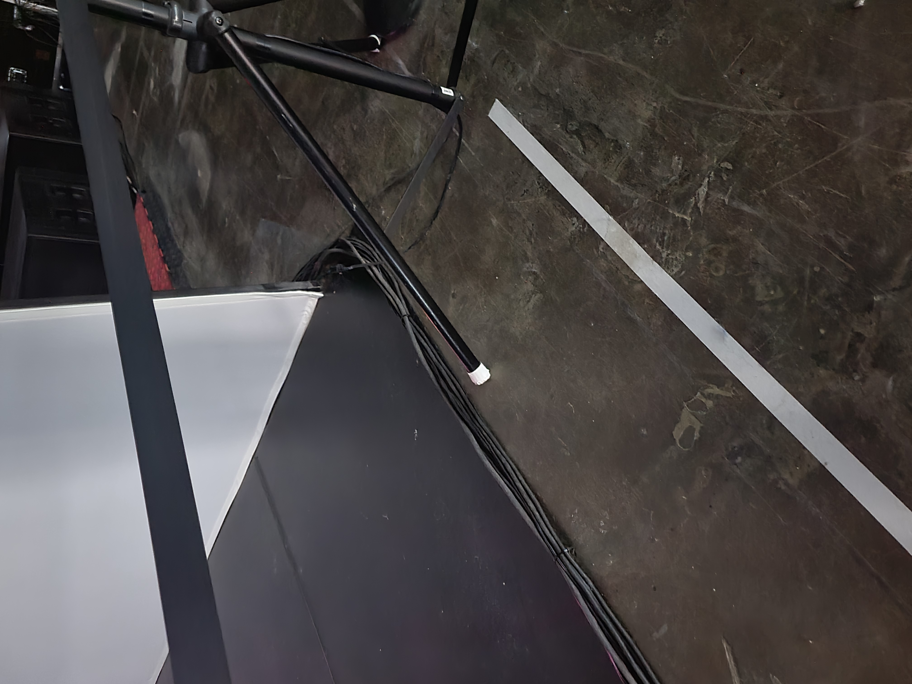
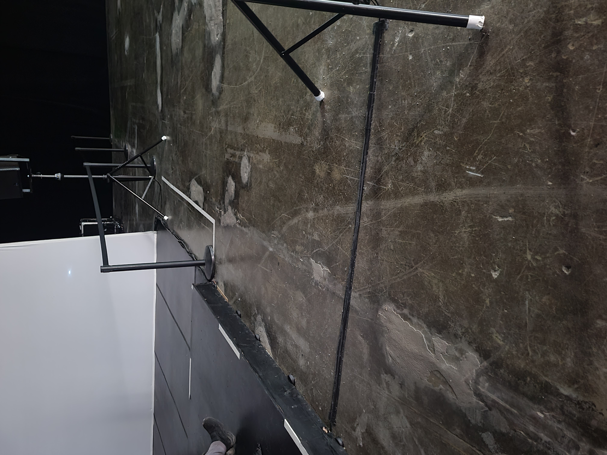
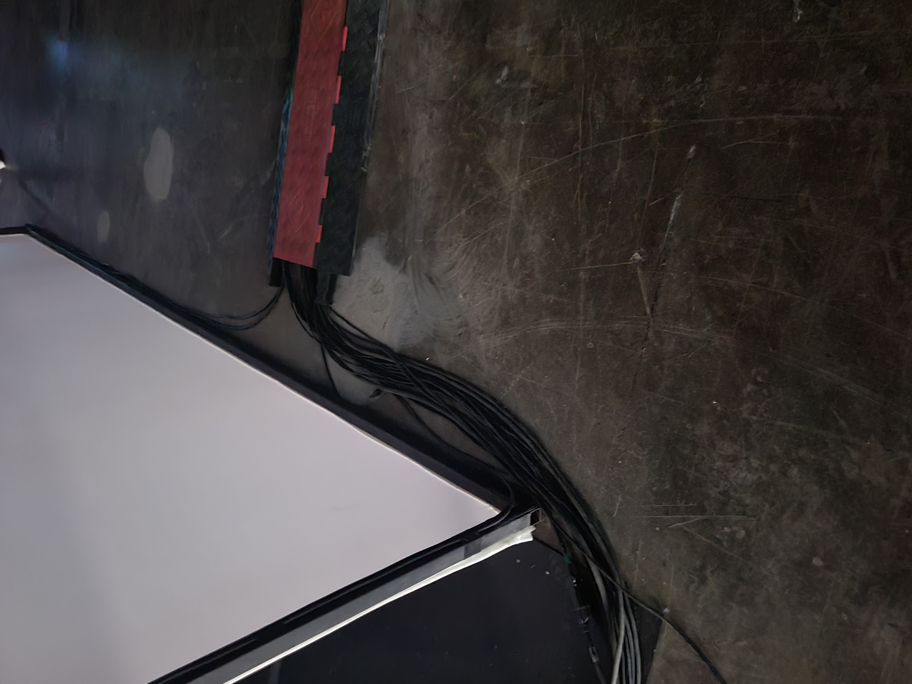
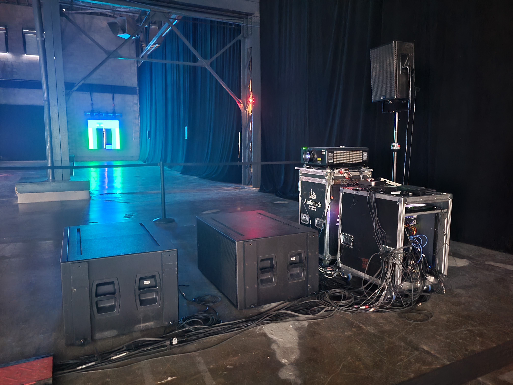

 ## Titre de l'oeuvre 
 
 *Unfold*
 
 ***Unfold***
 
  

 ## Nom de l'artiste
 
 Ryoichi Kurokawa

 ## Année de réalisation
 
 2016

 ## Nom de l'exposition 
 
 Metamorphosis (5e Biennale internationale d'art numérique)
 
 ## Lieu de mise en exposition
 
 Arsenal art contemporain Montréal

 ## Date de ma visite
 
 9 février 2022

 ## Description de l'oeuvre
 
 Kurokawa est un véritable poète du cinéma transformateur, transfigurant avec lyrisme les représentations analogiques de la nature perçue en flux numériques d'images et d'émotions vertigineuses. La précision architecturale de ses images fragmentaires synchronisées avec sensibilité, placées côte à côte sur notre rétine, tend à déplacer la persistance de la mémoire floue sous l'effet d 'une luminosité sans limite. Il considère l'élément audio et visuel comme les différents vecteurs d'une pièce unique et insiste sur le fait qu'ils doivent s'écouler ensemble pour entrer en collision en même temps. 
 
 Inspirée par les dernières découvertes dans le domaine de l'astrophysique, l'installation immersive et sensorielle de Ryoichi Kurokawa, cherche à traduire en sons, images et vibrations, les phénomènes entourant la formation et l'évolution des étoiles. Avec *unfold*, Ryoichi Kurokawa s'intéresse à la synesthésie, en fusionnant les matériaux sonores et visuels , au service d'un projet art/science inspiré des découvertes récentes. 
 
 (Ce texte est tiré du cartel d'exposition du Arsenal art contemporain)

 ## Explications sur la mise en espace de l'oeuvre 
 
 L’œuvre de Ryoichi Kurokawa se présente d’abord comme trois écrans se surmontant l’un par-dessus l’autre et ayant un angle chacun davantage aigu de manière à survoler au-dessus de nous. Celui se trouvant au-dessus de tous est retenu par deux câbles de soutien, c'est-à-dire en haut de chaque extémité, qui sont suspendus au plafond. Ensuite, une plateforme fait face à cette architecture afin d'inviter les visiteurs à aller s'asseoir. Elle permet de stimuler leur sens du toucher en transmettant les vibrations de l'installation multimédia. L’écart que sépare cette scène et les écrans est tapissé par quatre minces tapis noirs disposés sur la verticale. En poursuivant, cette disposition est entourée de six gros haut-parleurs sur trépied, soit deux à droite ainsi que deux autres à gauche, un derrière la plateforme pointant vers l'architecture, puis un dernier derrière les écrans. Ils stimulent le sens de l'ouïe en renvoyant différents sons. Tous sont liés à la scène au moyen de câbles qui sont recouverts d’un ruban-cache noir afin d’éviter de les endommager. De plus, de nombreux fils parcourent le long du tapis à l’extrémité de droite ainsi que certains derrière les écrans pour finalement tous se rejoindre derrière l'installation audiovisuelle. En effet, ils s’introduisent sous un cache-fil qui mène l’ensemble des câbles à la section régie où l’on contrôle le son de tous les œuvres dont *unfold*. On y trouve également un projecteur diffusant les nombreuses images accompagnant cette œuvre et stimulant ainsi le sens de la vue. Enfin, huit poteaux de canalisation liés par une sangle longent les tapis jusqu'à la régie pour éviter que les gens s'introduisent dans la section délimitée par ces piliers. 
 
 
 
  

 ## Liste des composantes et techniques de l'oeuvre 
 
 - Vidéos
 - Trame sonore
 
 

 ## Liste des éléments nécessaires pour la mise en exposition 
 
 
 
 
 
 - 3 écrans
 - 2 câbles de soutien
 - Plateforme 
 - 6 haut-parleurs
 - 6 trépieds
 - 4 tapis
 - Câbles
 - Ruban-cache noir
 - Chache-fil
 - Section régie
 - Projecteur
 - 8 plateaux de canalisation attachés par une sangle

 ## Expérience vécue :

 ### - Description de mon expérience de l'oeuvre
 
 J’ai grandement apprécié l’expérience offerte par l’œuvre proposée par Ryoichi Kurosawa. Avant de me rapprocher de cette présentation numérique, je croyais qu’il s’agissait uniquement d’une œuvre audiovisuelle et donc qu’il suffisait seulement d’observer les diverses images projetées pour se plonger dans cet univers étoilé. Cependant, en m’assoyant sur la scène, j’ai découvert, à mon plus grand étonnement, un élément de cette installation que je ne soupçonnais pas ; une immersion stimulant le sens du toucher. En effet, quand je me suis assise, j'ai ressenti l’ensemble des vibrations émises par les sons produits par *unfold*. Toutes ces sensations m’ont permis d’avoir une expérience davantage immersive et amusante.  

 ### - ❤️ Ce qui m'a plu
 
 Ce qui m'a particulièrement plu de *unfold* est le sens du toucher qui est abordé dans cette prestation audiovisuelle. Ainsi cela m'a donnée des idées. Par exemple, des actions réalisées dans un décor fictif projeté sur des écrans tactiles munis d'haut-parleurs englobant l'utilisateur stimulant les mêmes sens que celui de l'œuvre de Ryoichi Kurosawa, soient l'ouïe, la vue et le toucher. Pour se déplacer, cela se ferait sur un tapis roulant multidirectionnel. Il est plutôt rare d'incorporer le sens du toucher à une œuvre, donc je voudrais me mettre au défi de l'offrir.  

 ### - 🤔 Aspect que je ne souhaite pas retenir pour mes propres créations ou que je ferais autrement 
 
 Je ne souhaite pas retenir la plateforme, parce que je trouve que cela est encombrant et ne permet pas d’expérimenter tous les côtés qu’offrent le sens du toucher. 
 
 ### Références
 
 Site Web 
 
 [Lien vers la page informative de l'exposition sur le site de l'Arsenal art contemporain Montréal ](https://www.arsenalcontemporary.com/mtl/fr/exhib/detail/2021-elektra-5e-biennale)
