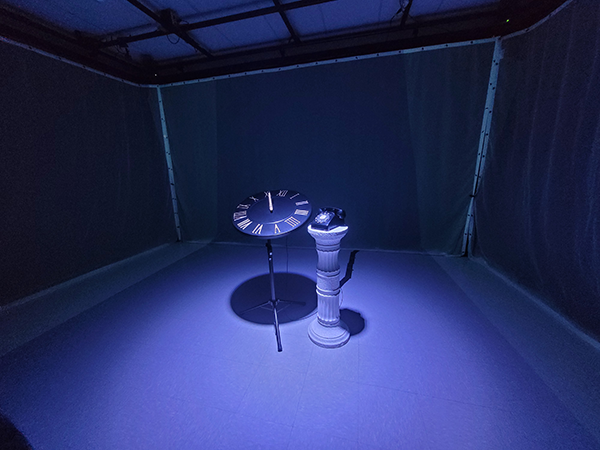
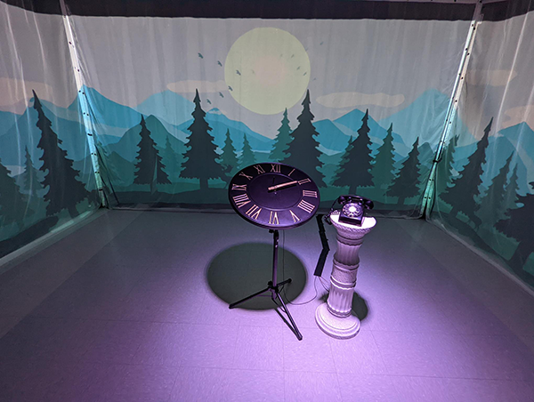
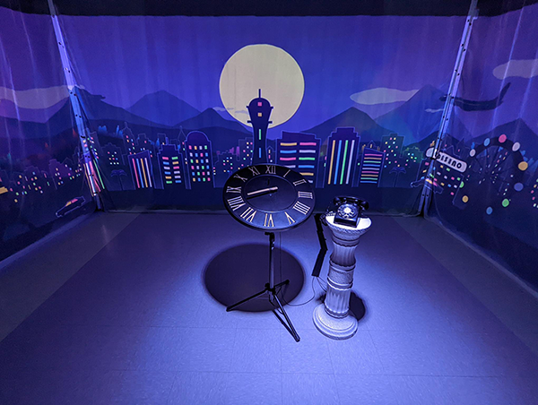

 ## Titre de l'oeuvre 
 
 L'horloge de l'apocalypse
 
 **Vue d'ensemble de l'expérience**
 
 

 ## Nom des artistes 
 
 Maxime Sabourin, Louis-Philippe Gravel, Alexis Lacasse, Tristan Girard-Montpetit et Maxime De Falco

 ## Année de réalisation
 
 2022

 ## Nom de l'exposition
 
 MOEBIUS

 ## Lieu de mise en exposition
 
 Petit studio de son au Collège Montmorency

 ## Date de ma visite
 
 23 mars 2022

 ## Description de l'oeuvre 
 
L’horloge de l’apocalypse représente la ligne du temps de l’humanité. Selon le concept de l’horloge, il est présentement 11 h 58 et il reste 2 minutes avant la fin de l’humanité. À travers ce projet, l’interacteur est invité à contrôler l’horloge grâce aux aiguilles et ainsi manipuler la ligne du temps. Au cours de l’expérience, vous pourrez vivre les différentes époques auxquelles la terre a été exposée. Vous serez exposé aux différents enjeux actuels à travers la projection qui vous entourera et par le fait même vous plongera dans une immersion totale.
 
 (Ce texte est tiré du résumé fait par l'équipe ayant réalisé l'oeuvre sur la page dédiée à *L'horloge de l'apocalypse* sur le site Web de TIM)
 
 ## Explications sur la mise en espace de l'oeuvre  
 
La présentation de *L'horloge de l'apocalypse* se fait dans une salle à part des autres projets, c'est-à-dire dans le petit studio dédié originalement au son. D'abord, au bout de la pièce, un horloge sur trépied ainsi qu'un pédestal romain où repose un téléphone à roulette se présentent. Ils sont situés l'un à côté de l'autre dans le milieu de la pièce. Chacun est lié à un fil où ceux-ci se rejoignent, par la suite, sous un ruban-cache noir au sol. De plus, des toiles blanches recouvrent les murs, dont lui du milieu affiche un message de mise en situation. Celui-ci explique à l'utilisateur qu'il peut avancer et reculer les aiguilles de l'horloge, mais qu'à l'approche de minuit, il n'en sera plus le cas. Chaque heure dévoile une scène et une ambiance différentes qui se rapprochent progressivement vers un décor impacté négativement par l'humanité. L'ambiance est crée par la musique qui ressort des quatre haut-parleurs intallés au plafond. Les illustrations sont exhibées par le moyen de projecteurs accrochés au plafond également. Ces dernières parcourent les trois murs offrant un plus grand panorama et une expérience plus immersive, puisqu'elles englobent les visiteurs. Enfin, l'expérience se termine losrque le téléphone sonne et qu'un individu répond à l'appel de la fin du monde. Cette action est projetée de trois angles différents, donc une perspective par mur. 

(Ces deux photographies sont tirées de la gallerie d'images de la page dédiée à *L'horloge de l'apocalypse* sur le site Web de TIM)

**Scène de 2h**

**Scène de 8h**

 

 ## Liste des composantes et techniques de l'oeuvre 
 
 - Animations 
 - Trame sonore

 ## Liste des éléments nécessaires pour la mise en exposition 
 
 - Téléphone à roulette
 - Trépied
 - Piédestal romain
 - Horloge à chiffres romains
 - Câbles
 - Ruban-cache noir
 - 3 toiles blanches 
 - 4 haut-parleurs
 - 3 projecteurs vidéo lentille ultra wide 0.3
 - Projecteur de lumière couleur
 - 3 systèmes d'acrochage

 ## Expérience vécue :

 ### - Description de mon expérience de l'oeuvre 
 
J'avais déjà eu un avant-goût des décors et de leurs musiques, mais j'ai tout de même été agréablement surprise de la disposition des éléments et du résultat final. Je me suis vraiment sentie immersée par les scènes qui proposent, au commencement, un monde de paix où la nature règne pour éventuellement laisser place à un monde de guerre où la destruction domine. L'aspect visuel me sensibilise davantage, puisque c'est alors que je réussis à réellement voir les impacts des gestes que l'on commet. Ce projet explore le côté interactif d'une oeuvre en nous donnant plein contrôle, plus précisément, la possibilité de changer de scène en avançant ou reculant simplement l'aiguille dorée de l'horloge. En plus de cela, on termine avec une intention de rétrospection sur soi-même en projetant le répondant de l'appel à la fin du monde.  

 ### - ❤️ Ce qui m'a plu
 
Ce qui m'a majoritairement plu de *L'horloge de l'apocalypse* est le contrôle donné à l'utilisateur lorsqu'il est amené à avancer et à reculer les aiguilles comme il le veut. Cela permet d'expérimenter l'oeuvre pleinement et de bien comprendre de quoi il s'agit. Aucun regret ni confusion s'en suit ainsi le message est sûr d'être intercepté. C'est très bénéfique quand l'objectif est de sensibiliser le public.  

 ### - 🤔 Aspect que je ne souhaite pas retenir pour mes propres créations ou que je ferais autrement 
 
Malgré le fait qu'il s'agit d'une bonne idée, je ne souhaiterais pas retenir la dernière partie du projet, c'est-à-dire lorsque l'on projète l'intéracteur qui décroche le téléphone, car cela ne plaît pas à tout le monde, spécialement les plus timides d'entre nous, d'être celui sur lequel les regards sont dirigés.

 ## Références
 
Github 

[Lien vers le Github de *L'horloge de l'apocalypse*](https://github.com/MALT5/L-horloge-de-l-apocalypse)

Site Web 

[Lien vers la page de renseignements de *L'horloge de l'apocalypse* sur le site de TIM](https://tim-montmorency.com/2022/projets/L-horloge-de-l-apocalypse/docs/web/index.html)

