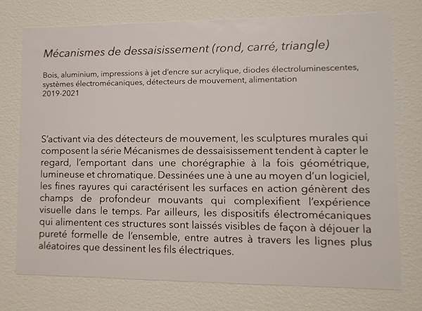
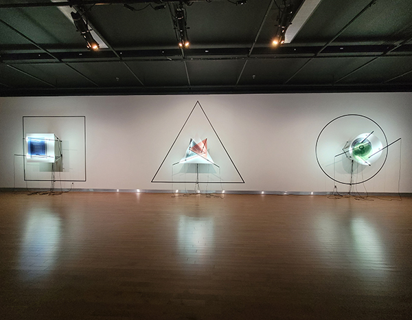
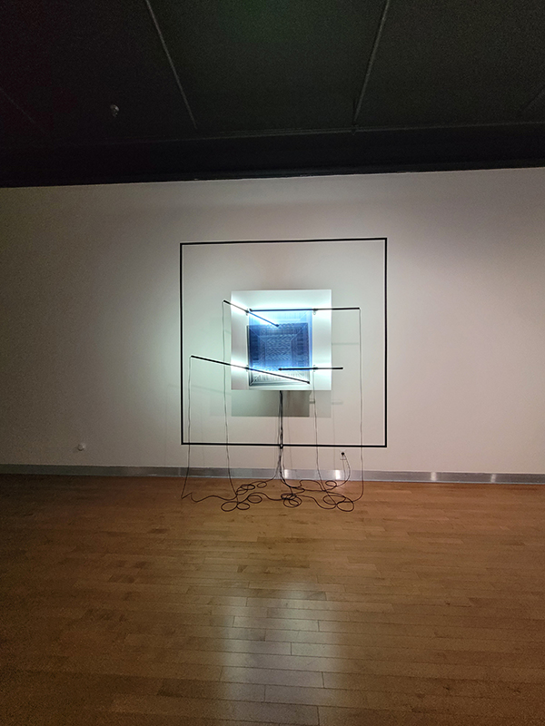
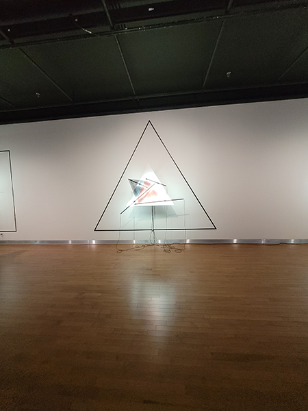
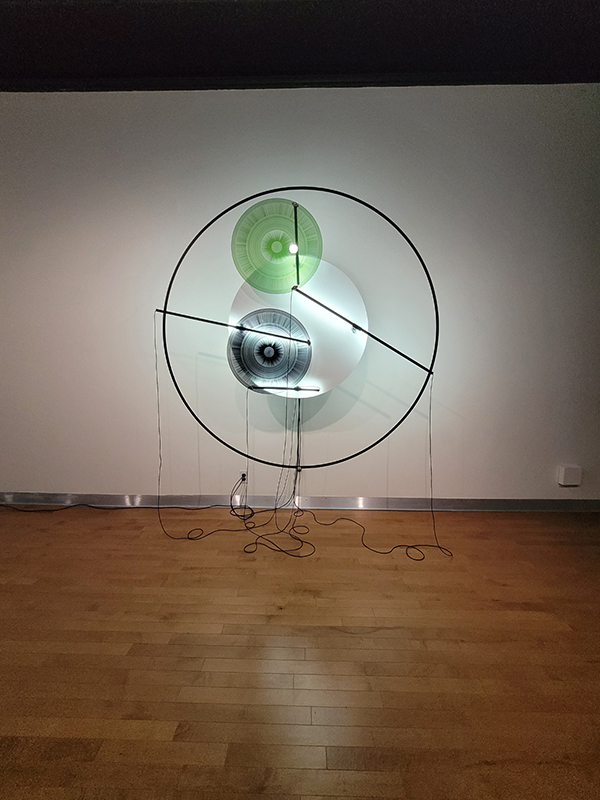
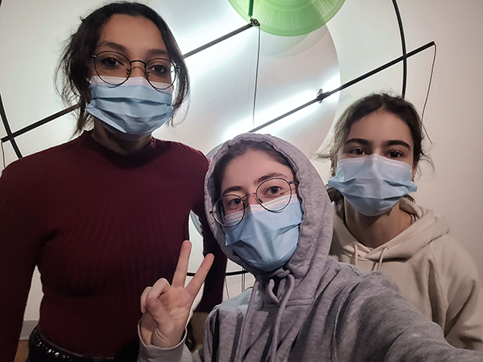

 ## Titre de l'oeuvre ou de la réalisation
 
 *Mécanismes de dessaisissement (rond, carré, triangle)*

 ## Nom de l'artiste ou de la firme
 
 Catherine Béchard et Sabin Hudon

 ## Année de réalisation
 
 2019-2020

 ## Nom de l'exposition

 Béchard Hudon - Configurations du sensible

 ## Lieu de mise en exposition
 
 Salle Alfred-Pellan

 ## Date de votre visite
 
 16 mars 2022

 ## Description de l'oeuvre ou du dispositif multimédia (à composer ou reprendre la description offerte sur le site de l'artiste ou le cartel de l'exposition en citant bien sa source)

S'activant via des détecteurs de mouvement, les sculptures murales qui composent la série Mécanismes de dessaisissement tendent à capter le regard, l'emportant dans une chorégraphie à la fois géométrique, lumineuse et chromatique. Dessinées une à une au moyen d'un logiciel, les fines rayures qui caractérisent les surfaces en action génèrent des champs de profondeur mouvants qui complexifient l'expérience visuelle dans le temps. Par ailleurs, les dispositifs électromécaniques qui alimentent ces structures sont laissés visibles de façon à déjouer la pureté formelle de l'ensemble, entre autres à travers les lignes plus aléatoires que dessinent les fils électriques. 

(Ce texte est tiré du cartel d'exposition de la salle Alfred-Pellan)

**Cartel de l'oeuvre**

 ## Explications sur la mise en espace de l'oeuvre ou du dispositif 
 
 **Vu d'ensemble de l'oeuvre**
 
 
 
L'oeuvre des artistes mentionnés précédemment est composée de trois installations distinctes qui représentent tous une forme géométrique, soit le carré, le triangle ou le cercle. Ces dernières prennent la largeur d'un mur de la salle d'exposition et sont séparées par une certaine distance. Elles se présentent telles des structures murales tridimensionnelles dû à leur superposition d'éléments. D'abord, leur forme respective est délimitée en grand au mur avec du ruban noir créant ainsi un effet de profondeur. Ensuite, un morceau de bois coupé selon cette même forme sert de soutient aux deux plaques d'acrylique et permet de, notamment dissimuler le mécanisme caché derrière, mais également de détacher ces plaques du fond et de créer une meilleure projection de la lumière renvoyée par les quatre barres lumineuses. Celles-ci apportent une meilleure définition des lignes imprimées dans les plaques d'acrylique ayant la géométrie de leur forme respective, dont l'une est noire et l'autre d'une couleur qui est soit le bleu, le rouge ou le vert. De plus, le mouvement mécanique s'active et s'arrête en fonction du détecteur de mouvement inclu à chaque structure murale qui indique si une présence est détectée ou non. Si ce n'est pas le cas, le mécanisme peut donc se reposer, en plus d'économiser de l'électricité. Béchard et Hudon ont poussé l'idée de produire de la géométrie perceptuelle en intégrant un effet d'illusion d'optique lors de la superposition des deux formes d'acrylique. En effet, les lignes semblent défilées à une vitesse qui diffère selon la superposition exposée. Enfin, plusieurs câbles sont apparents dans les oeuvres, c'est-à-dire un rattaché à chacune des barres lumineuses et six autres au mécanisme dissimulé, et ce, pour chaque composition. 

**La structure murale du carré de** ***Mécanismes de dessaisissement (rond, carré, triangle)*** 

**La structure murale du triangle de** ***Mécanismes de dessaisissement (rond, carré, triangle)*** 

**La structure murale du rond de** ***Mécanismes de dessaisissement (rond, carré, triangle)*** 

 ## Liste des composantes et techniques de l'oeuvre ou du dispositif (ex. : réalité virtuelle, projecteurs, caméra USB, anneau lumineux...)

 ## Liste des éléments nécessaires pour la mise en exposition (ex. : crochets, sac de sable, câbles de soutien...)

 ## Expérience vécue :

 ### - Description de votre expérience de l'oeuvre ou du dispositif, de l'interactivité, des gestes à poser, etc.
 
 **Moi et mes amies devant la structure murale du rond de** ***Mécanismes de dessaisissement (rond, carré, triangle)***
 

 
Durant la visite des oeuvres réalisées par les artistes en question, *Mécanismes de dessaisissement (rond, carré, triangle)* a tout particulièrement attiré mon regard dû à l'espace qu'il prenait ainsi que ses couleurs, absentes sur la majorité des autres oeuvres. En me rapprochant, les détails offerts dans les lignes et le mouvement des plaques d'acrylique m'ont beaucoup captivés. Ces structures murales se rendent uniques par leur complexité épurée, car malgré les manoeuvres complexes, les installations en elles-mêmes restent simples, en d'autres mots, elles ne sont pas surchargées d'éléments venant à irriter le public. J'ai été d'autant plus fascinée par ces compositions lorsque l'on nous a avertit de l'illusion d'optique présentes dans celles-ci.

 ### - ❤️ Ce qui vous a plu, vous a donné des idées et justifications
 
Ce qui m'a plu de *Mécanismes de dessaisissement (rond, carré, triangle)* est l'idée d'inclure une illusion d'optique à l'oeuvre, car elle amène une particularité de plus à l'oeuvre ce qui la rend davantage unique et lui permet de se démarquer des autres oeuvres. Ainsi, pousser son idée jusqu'au bout en développant une individualité à son oeuvre serait un concept à conserver et à reproduire. 

 ### - 🤔 Aspect que vous ne souhaiteriez pas retenir pour vos propres créations ou que vous feriez autrement et justifications
 
 Je ne souhaiterais pas conserver le fait de laisser autant de fils visibles, je trouve personnellement que cela enlève un certain esthétique à l'oeuvre. 
 
 ## Références

Site Web 

[Lien vers le site de Catherine Béchard et Sabin Hudon](https://bechardhudon.com/)
