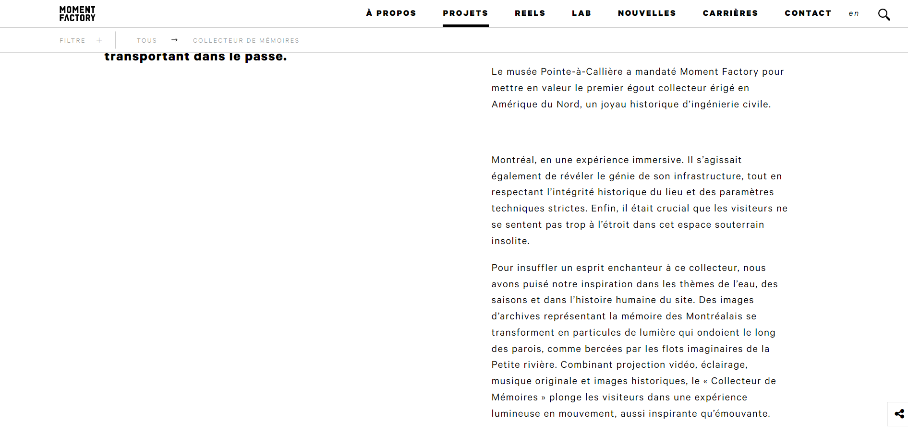

 ## Titre de l'oeuvre 
 
 Collecteur de mémoires 

 ## Nom de la firme
 
 Moment Factory

 ## Année de réalisation
 
 2017

 ## Nom de l'exposition 
 
 Collecteur de mémoires

 ## Lieu de mise en exposition
 
 Musée Pointe-à-Callière

 ## Date de ma visite
 
 16 février 2022

 ## Description de l'oeuvre

Le musée Pointe-à-Callière a mandaté Moment Factory pour mettre en valeur le premier égout collecteur érigé en Amérique du Nord, un joyau historique d’ingénierie civile.

Montréal, en une expérience immersive. Il s’agissait également de révéler le génie de son infrastructure, tout en respectant l’intégrité historique du lieu et des paramètres techniques strictes. Enfin, il était crucial que les visiteurs ne se sentent pas trop à l’étroit dans cet espace souterrain insolite.

Pour insuffler un esprit enchanteur à ce collecteur, nous avons puisé notre inspiration dans les thèmes de l’eau, des saisons et dans l’histoire humaine du site. Des images d’archives représentant la mémoire des Montréalais se transforment en particules de lumière qui ondoient le long des parois, comme bercées par les flots imaginaires de la Petite rivière. Combinant projection vidéo, éclairage, musique originale et images historiques, le « Collecteur de Mémoires » plonge les visiteurs dans une expérience lumineuse en mouvement, aussi inspirante qu’émouvante.

**Description de l'oeuvre faite par *Moment Factory***

(Ce texte est tiré de la page Web dédiée au *Collecteur de mémoires* sur le site de *Moment Factory*)

 ## Explications sur la mise en espace de l'oeuvre 
 
 L'oeuvre se déroule à l'intérieur de ce qui était autrefois un égoût. Lorsque l'on franchit l'entrée de cet endroit souterrain, on est accueilli par des lumières alternant entre les couleurs froides et les couleurs chaudes, notamment du bleu au rose. L'obscurité de l'égoût s'éclaircit grâce à ses lampes placées tout le long du parcours artistique qui sont recouvertes de blocs transparents pour diffuser la lumière. D'autres projecteurs sont situés également le long du tunnel. Ils s'identifient par des boîtes rectangulaires soutenus d'un support métallique qui projètent des motifs ronds de diverses couleurs tels que le jaune, le rouge et le vert ressemblant étrangement à des étoiles lorsque l'on a une position éloignée de ceux-ci. La trame sonore se divulgue par l'entremise de petits haut-parleurs ayant une forme ovale dissimulés sur les côtés. On marche sur une grille cachant des processeurs ce qui expliquerait probablement le choix de celle-ci qui empêche que le moteur de ces derniers ne s'étouffent. De plus, des petits passages dans l'égoût sont illuminés majoritairement de lumières jaunes grâce à de très petits projecteurs noirs liés par un fil noir se cachant dans les parrois de pierre. De nombreux câbles se perdent dans ces murs pour éviter qu'on ne les voit et garder l'aspect fantaisiste de l'oeuvre multimédia. Le parcours se termine sur une projection d'images historiques en alternance qui ont été modifiées pour qu'elles aillent un filtre vert et ainsi ressortir et s'harmoniser avec le reste de l'oeuvre. Le même projecteur que celui des motifs projètent ces photographies et un autre en suspension projète un effet de chûte par-dessus ces dernières.  

 ## Liste des composantes et techniques de l'oeuvre ou du dispositif (ex. : réalité virtuelle, projecteurs, caméra USB, anneau lumineux...)
 
 - 15 projecteurs rectangulaires accompagnés de leur support métallique
 - Petits projecteurs
 - Trame sonore 
 - Illustrations

 ## Liste des éléments nécessaires pour la mise en exposition (ex. : crochets, sac de sable, câbles de soutien...)
 
 - Câbles
 - Petits haut-parleurs ovales

 ## Expérience vécue :

 ### - Description de mon expérience de l'oeuvre 
 
Lorsque je suis entrée à l'intérieur de l'égoût, l'ambiance créée par les lumières m'a vraiment charmée. Cela amène un contraste entre la répugnance d'un égoût, généralement froid, dégoûtant et obscur. Je me sentais dans un autre monde, un peu fantaisiste, qui sort de l'ordinaire. Le parcours est surprenamment plus long que ce que j'imaginais même si je crois que pour certains il est trop court. La musique nous plonge davantage dans cet endroit féerique où le moindre bruit résonne. Cela approfondit d'autant plus cette sensation d'éloignement de la réalité qui est le monde extérieur. Les attentes que je m'avais faites de ce lieu historique devenu une expérience immersive ont été comblées. 

 ### - ❤️ Ce qui m'a plu
 
Ce qui m'a spécialement plu était le jeu de lumières, j'ai vraiment trouvé que c'était l'élément qui transformait l'égoût en un passage amusant et spécial. Sans enlever l'obscurité complète de cet endroit, *Moment Factory* a décidé d'opter pour des lumières artificielles colorées au lieu de simples lumières blanches qui auraient compromis l'aspect sombre du lieu. Cela m'incite à utiliser ce type de lumières dans de futures créations. 

 ### - 🤔 Aspect que je ne souhaite pas retenir pour mes propres créations ou que je ferais autrement 
 
 Je pense que j'aurais mis des photographies le long des murs en plus de celles dévoilées au bout de l'égoût, car cela aurait été présenté plus comme un musée. En effet, selon moi, l'histoire derrière l'égoût aurait été davantage mis à l'avant en projetant des photographies de sa construction sur les murs du tunnel. 
 
 ## Références
 
 Sites Web
 
 [Lien vers la page Web du *Collecteur de mémoires* sur le site de *Moment Factory*](https://momentfactory.com/projets/tous/tous/collecteur-de-memoires)
 
 [Lien vers la page Web du *Collecteur de mémoires* sur le site du musée Pointe-à-Callière](https://pacmusee.qc.ca/fr/expositions/detail/collecteur-de-memoires/)
